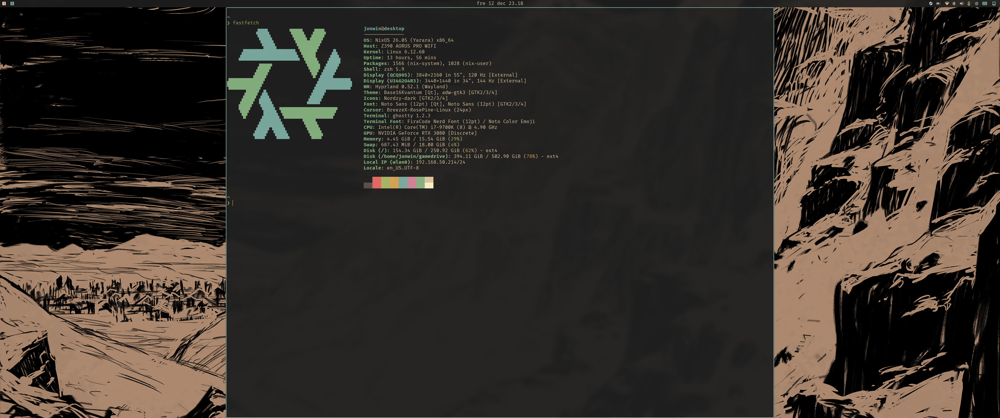

# NixOS Jonwin

My NixOS configuration for multiple hosts, built using the dendritic pattern
with [flake-parts](https://github.com/hercules-ci/flake-parts) and
[import-tree](https://github.com/denful/import-tree).



## Features

- 🖥️ **Multiple Hosts Support**: Easy to configure for different hosts.
- 🪟 **Hyprland + Waybar**: Highly configurable window compositor on Wayland.
- ⚙️ **Rofi + jwmenu**: Applications launcher and custom system menus.
- 🏠 **Home Manager Integration**: Manage user-specific configurations with
ease.
- 🐚 **Zsh + Starship**: Efficient shell setup with useful aliases.
- 👻 **Ghostty**: Fast and feature-rich terminal emulator.
- ✍️ **Neovim**: Configured through [nvf](https://github.com/NotAShelf/nvf), see
[jonwin1/nvf-config](https://github.com/jonwin1/nvf-config).
- 🔑 **YubiKey Login**: Fast and secure authentication with YubiKeys.
- 💾 **Full Disk Encryption**: [YubiKey-based
FDE](https://jonwin.se/posts/yubikey-fde/) for secure and convenient unlock.
- ✨ **Stylix**: Unified system theming.

## Host Template

TODO

## Module Template

Every module exports a NixOS module and may optionally contain a Home Manager
module which is imported by the NixOS module, this avoids having to
differentiate between NixOS and Home Manager modules when importing.

```nix
{ self, imports, ... }: {
  flake.nixosModules.MODULE = { pkgs, lib, config, ... }: {
    home-manager.users.${config.my.username}.imports = [
      self.homeModules.MODULE
    ];

    # NixOS options
  };

  flake.homeModules.MODULE = { pkgs, lib, my, ... }: {
    # my on the line above is equivalent to config.my in nixosModules

    # Home Manager options
  };
}
```

## Installation

https://jonwin.se/posts/yubikey-fde/

TODO

<!---->
<!-- > As of march 2026 I have migrated both my hosts to using full disk encryption, -->
<!-- > which requires [this](https://jonwin.se/posts/yubikey-fde/) more advanced -->
<!-- > setup process. The below steps should still work, but the disk encryption -->
<!-- > options must be removed from the options. -->
<!---->
<!-- To get started with this setup, follow these steps: -->
<!---->
<!-- 1. **Install NixOS** -->
<!---->
<!--    If you haven’t already installed NixOS, follow the [NixOS Installation Guide](https://nixos.org/manual/nixos/stable/#sec-installation) for detailed instructions. -->
<!---->
<!-- 2. **Clone the Repository** -->
<!---->
<!--     ```bash -->
<!--     git clone https://github.com/jonwin1/nixos-jonwin -->
<!--     cd nixos-jonwin -->
<!--     ``` -->
<!---->
<!-- 3. **Copy one of the host configurations to set up your own** -->
<!---->
<!--     ```bash -->
<!--     cp -r config/desktop config/<your_hostname> -->
<!--     ``` -->
<!---->
<!-- 4. **Put your `hardware-configuration.nix` file there** -->
<!---->
<!--     ```bash -->
<!--     cp /etc/nixos/hardware-configuration.nix nixos/<your_hostname>/ -->
<!--     ``` -->
<!---->
<!-- 5. **Edit the configuration files as needed** -->
<!---->
<!--     See [File Structure](#-file-structure) below for an overview of where to find what. -->
<!--     You might for example what to set you git name and email or change the name -->
<!--     and logo on the hyprlock screen. -->
<!---->
<!-- 6. **Add a YubiKey or disable the module** -->
<!---->
<!--    See [NixOS Wiki - YubiKey PAM U2F](https://wiki.nixos.org/wiki/Yubikey#pam_u2f) -->
<!--    or remove the module from `modules/default.nix`. -->
<!---->
<!-- 7. **Edit the `flake.nix` file** -->
<!---->
<!--     ```diff -->
<!--     ... -->
<!--     let -->
<!--       hosts = [ -->
<!--     --  { -->
<!--     --    user = "jonwin"; -->
<!--     --    hostname = "desktop"; -->
<!--     --    system = "x86_64-linux"; -->
<!--     --  } -->
<!--     --  { -->
<!--     --    user = "jonwin"; -->
<!--     --    hostname = "laptop"; -->
<!--     --    system = "x86_64-linux"; -->
<!--     --  } -->
<!--     ++  { -->
<!--     ++    user = "<your_username>"; -->
<!--     ++    hostname = "<your_hostname>"; -->
<!--     ++    system = "x86_64-linux"; -->
<!--     ++  } -->
<!--       ]; -->
<!--     ... -->
<!--     ``` -->
<!---->
<!-- 8. **Rebuild** -->
<!---->
<!--     ```bash -->
<!--     git add . -->
<!--     sudo nixos-rebuild switch --flake .#<hostname> -->
<!--     # or, if you're installing on a fresh system: -->
<!--     sudo nixos-install --flake .#<hostname> -->
<!---->
<!-- 9. **Wallpaper** -->
<!---->
<!--     Put wallpapers in ```~/Pictures/wallpaper/```, if there are multiple images -->
<!--     in the directory they will be cycled through on an interval. -->
<!--     [This](https://github.com/dharmx/walls) is a good place to find multiple -->
<!--     wallpapers that fit a theme. -->


## Project Structure

```markdown
📂 .
├ 📂 modules                  Imported by import-tree
│ ├ 📂 apps                   GUI applications
│ ├ 📂 collections            of core modules and programs
│ ├ 📂 drivers                E.g. Nvidia GPU
│ ├ 📂 hosts
│ │ └ 📂 hostname
│ │   ├ ❄️ configuration.nix  Host-specific nixos and home-manager options
│ │   ├ ❄️ default.nix        Module imports
│ │   ├ ❄️ hardware.nix       Hardware configuration (Generated)
│ │   └ ...                   Host-specific modules
│ ├ 📂 scripts                Custom scripts installed as packages
│ ├ 📂 shell                  Shell and terminal applications
│ ├ 📂 system                 System services and programs (network, audio, wm, ...)
│ ├ ❄️ parts.nix              flake-parts config
│ └ ❄️ template.nix           Module template (as explained previously)
└ ❄️ flake.nix                Main entry point
```

## Contributions

Contributions and suggestions are welcome, and feel free to use anything you
find here in your own configuration.

## License

This project is licensed under the GPL-3.0 License. See the [LICENSE](LICENSE)
file for details.
