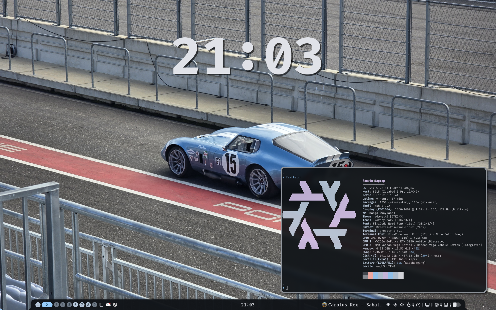

# NixOS Jonwin

My NixOS configuration for multiple hosts, built using the dendritic pattern
with [flake-parts](https://github.com/hercules-ci/flake-parts) and
[import-tree](https://github.com/denful/import-tree).



---

## Features

- 🖥️ **Multiple Hosts Support**: Easy to configure for different hosts.
- 🪟 **MangoWM**: Lightweight & Feature-Rich Wayland compositor.
- ✨ **Noctalia**: A sleek, customizable desktop shell crafted for Wayland.
- 🐚 **Zsh + Starship**: Efficient shell setup with useful aliases.
- 👻 **Ghostty**: Fast and feature-rich terminal emulator.
- ✍️ **Neovim**: Configured through [nvf](https://github.com/NotAShelf/nvf), see
[jonwin1/nvf-config](https://github.com/jonwin1/nvf-config).
- 🔑 **YubiKey Login**: Fast and secure authentication with YubiKeys.
- 💾 **Full Disk Encryption**: [YubiKey-based
FDE](https://jonwin.se/posts/yubikey-fde/) for secure and convenient unlock.

---

## Installation

To install with full disk encryption and YubiKey unlock follow the steps
outlined in [this post](https://jonwin.se/posts/yubikey-fde/). To install
without, the process is more or less the same, just skip anything encryption
related. Also see the [NixOS Installation
Guide](https://nixos.org/manual/nixos/stable/#sec-installation).

1. After completing the initial NixOS installation clone the repository:

    ```sh
    git clone https://github.com/jonwin1/nixos-jonwin
    cd nixos-jonwin
    ```

2. Copy the host template to set up your own.

    ```bash
    cp -r modules/hosts/template modules/hosts/<your_hostname>
    ```

3. Copy paste the content of `etc/nixos/hardware-configuration.nix` into
   `modules/hosts/<your_hostname>/hardware.nix`.

4. Edit the host configuration files as needed, change every occurrence of
   HOSTNAME and USERNAME to the appropriate value. Then choose which modules to
include, pick one profile from `modules/profiles` and remember to include
`modules/system/luks-fido2.nix` when using the disk encryption from the post
mentioned above.

5. Optionally add a YubiKey for PAM, see `modules/system/yubikey.nix` and [NixOS
   Wiki - YubiKey PAM U2F](https://wiki.nixos.org/wiki/Yubikey#pam_u2f).

6. Rebuild.

    ```bash
    git add .
    sudo nixos-rebuild switch --flake .#<hostname>
    ```

---

## Project Structure

```markdown
📂 .
├ 📂 modules                  Imported by import-tree
│ ├ 📂 apps                   GUI applications
│ ├ 📂 drivers                E.g. Nvidia GPU
│ ├ 📂 hosts
│ │ └ 📂 hostname
│ │   ├ ❄️ configuration.nix  Host-specific nixos and home-manager options
│ │   ├ ❄️ default.nix        Module imports
│ │   ├ ❄️ hardware.nix       Hardware configuration (Generated)
│ │   └ ...                   Host-specific modules
│ ├ 📂 profiles               Presets of modules and programs
│ ├ 📂 scripts                Custom scripts installed as packages
│ ├ 📂 shell                  Shell and terminal applications
│ ├ 📂 system                 System services and programs (network, audio, wm, ...)
│ ├ ❄️ parts.nix              flake-parts config
│ └ ❄️ template.nix           Module template (as explained previously)
└ ❄️ flake.nix                Main entry point
```

---

## Host Template

A system host template can be found at `modules/hosts/template/`. It contains 3
files:

- `default.nix` imports for all modules which should be included in the host,
- `configuration.nix` NixOS options, Home Manager options, and packages for the
host,
- and `hardware.nix` for the content of `/etc/nixos/hardware-configuration.nix`.

## Module Template

A module template can be found in `modules/template.nix` and is shown below.

Every module exports a NixOS module and may optionally contain a Home Manager
module or a wrapped package, which are imported by the NixOS module. This avoids
having to differentiate between NixOS and Home Manager modules when importing.

Modules are imported in host configurations or other modules and packages can be
installed on the system or executed from the command line with `nix run
github:jonwin1/nixos-jonwin#PACKAGE`.

```nix
{ self, imports, ... }: {
  flake = {
    nixosModules.MODULE = { pkgs, lib, config, ... }: {
      home-manager.users.${config.my.username}.imports = [
        self.homeModules.MODULE
      ];

      environment.systemPackages = [
      #   self.packages.${pkgs.stdenv.hostPlatform.system}.PACKAGE
      ];

      # NixOS options
    };

    homeModules.MODULE = { pkgs, lib, my, ... }: {
      # my on the line above is equivalent to config.my in nixosModules

      # Home Manager options
    };

    wrappers.PACKAGE = { wlib, ... }: {
      # imports = [ wlib.wrapperModules.PACKAGE ];
      # OR
      # imports = [ wlib.modules.default ];
      # package = pkgs.PACKAGE;

      # Package options
    };
  };
}
```

---

## Contributions

Contributions and suggestions are welcome, and feel free to use anything you
find here in your own configuration.

## License

This project is licensed under the GPL-3.0 License. See the [LICENSE](LICENSE)
file for details.
