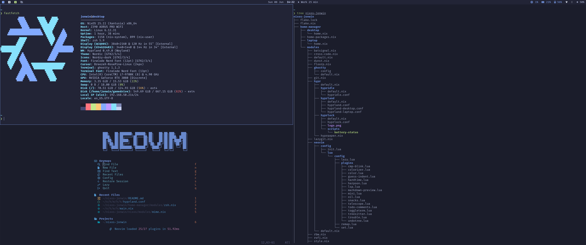

# ❄️ NixOS Jonwin

Welcome to my NixOS configuration.



## ✨ Features

- 🖥️ **Multiple Hosts Support**: Easy to configure for different hosts.
- 🪟 **Hyprland + Waybar**: Highly configurable window compositor on Wayland.
- 🏠 **Home Manager Integration**: Manage user-specific configurations with ease.
- 🐚 **Zsh + Starship**: Efficient shell setup with lots of aliases.
- 👻 **Ghostty**: Fast and feature-rich terminal emulator.
- ✍️ **Neovim**: With simple configuration through [nvf](https://github.com/NotAShelf/nvf).
- 🔑 **YubiKey Login**: Fast and secure authentication with YubiKeys.
- ✨ **Stylix**: Unified system theming.

## 📝 Notes

- I’ve chosen to tightly integrate **Home Manager** and **NixOS** within the
  same file and directory structure, rather than separating them into different
  files and folders. This keeps the configuration more cohesive but comes with
  some important caveats:
  - **Home Manager options** must always be written inside a:
    ```nix
    home-manager.users.${user} = {
      ...
    };
    ```
    block within your configuration files.
  - **Home Manager attributes cannot be imported at the top level** (outside of
    the `home-manager.users.<user>` block). For example:
    ```nix
    { pkgs, user, ... }:
    {
      home-manager.users.${user} = { config, ... }: {
        programs.rofi = {
          ...
          theme = let
            inherit (config.lib.formats.rasi) mkLiteral;
          in {
            ...
          };
        };
      };
    }
    ```
    Here, **note that `config` is only available within the
    `home-manager.users.<user>` block**—trying to import Home Manager attributes
    directly at the top level will fail.
- This design choice reduces duplication and keeps related configurations
  together, but it requires extra attention to **module scoping** and to
  **distinguishing between NixOS and Home Manager settings**.
- If you prefer a more typical separated configuration structure (e.g. fully
  declarative Home Manager setup using `home.nix` per host), check out
  [Andrey0189’s NixOS Config Reborn](https://github.com/Andrey0189/nixos-config-reborn),
  which this repository was briefly based on before the latest refactor.


## 🚀 Installation

To get started with this setup, follow these steps:

1. **Install NixOS**

   If you haven’t already installed NixOS, follow the [NixOS Installation Guide](https://nixos.org/manual/nixos/stable/#sec-installation) for detailed instructions.

2. **Clone the Repository**

    ```bash
    git clone https://github.com/jonwin1/nixos-jonwin
    cd nixos-jonwin
    ```

3. **Copy one of the host configurations to set up your own**

    ```bash
    cp -r config/desktop config/<your_hostname>
    ```

4. **Put your `hardware-configuration.nix` file there**

    ```bash
    cp /etc/nixos/hardware-configuration.nix nixos/<your_hostname>/
    ```

5. **Edit the configuration files as needed**

    See [File Structure](#-file-structure) below for an overview of where to find what.
    You might for example what to set you git name and email or change the name
    and logo on the hyprlock screen.

6. **Add a YubiKey or disable the module**

   See [NixOS Wiki - YubiKey PAM U2F](https://wiki.nixos.org/wiki/Yubikey#pam_u2f)
   or remove the module from `modules/default.nix`.

7. **Edit the `flake.nix` file**

    ```diff
    ...
    let
      hosts = [
    --  {
    --    user = "jonwin";
    --    hostname = "desktop";
    --    system = "x86_64-linux";
    --  }
    --  {
    --    user = "jonwin";
    --    hostname = "laptop";
    --    system = "x86_64-linux";
    --  }
    ++  {
    ++    user = "<your_username>";
    ++    hostname = "<your_hostname>";
    ++    system = "x86_64-linux";
    ++  }
      ];
    ...
    ```

8. **Rebuild**

    ```bash
    git add .
    sudo nixos-rebuild switch --flake .#<hostname>
    # or, if you're installing on a fresh system:
    sudo nixos-install --flake .#<hostname>

9. **Wallpaper**

    Put wallpapers in ```~/Pictures/wallpaper/```, if there are multiple images
    in the directory they will be cycled through on an interval.
    [This](https://github.com/dharmx/walls) is a good place to find multiple
    wallpapers that fit a theme.


## 📂 File Structure

```markdown
📂 .
┣ ❄️ flake.nix (Main entry point for the NixOS flake)
┣ 📂 config/ (Host and shared configuration files)
┃ ┣ ❄️ configuration.nix (Shared config options)
┃ ┣ ❄️ packages.nix (Shared packages)
┃ ┗ 📂 <hostname>/ (Settings for a specific machine)
┃   ┣ ❄️ configuration.nix (Host-specific config options)
┃   ┣ ❄️ hardware-configuration.nix (Hardware configuration for this host)
┃   ┣ ❄️ default.nix (Host-specific module imports)
┃   ┣ ❄️ packages.nix (Host-specific packages)
┃   ┗ 📂 modules/ (Host-specific nix modules)
┣ 📂 modules/ (Reusable nix modules)
┃ ┣ ❄️ default.nix (Default module imports)
┃ ┗ … (e.g. window manager, shell, applications)
┗ 📂 scripts/
```

## 🤝 Contributions

Feel free to fork the repository and submit pull requests if you'd like to
contribute improvements. Open issues if you encounter any problems with the
config or have ideas for new features.

## 📜 License

This project is licensed under the GPL-3.0 License. See the [LICENSE](LICENSE)
file for details.
